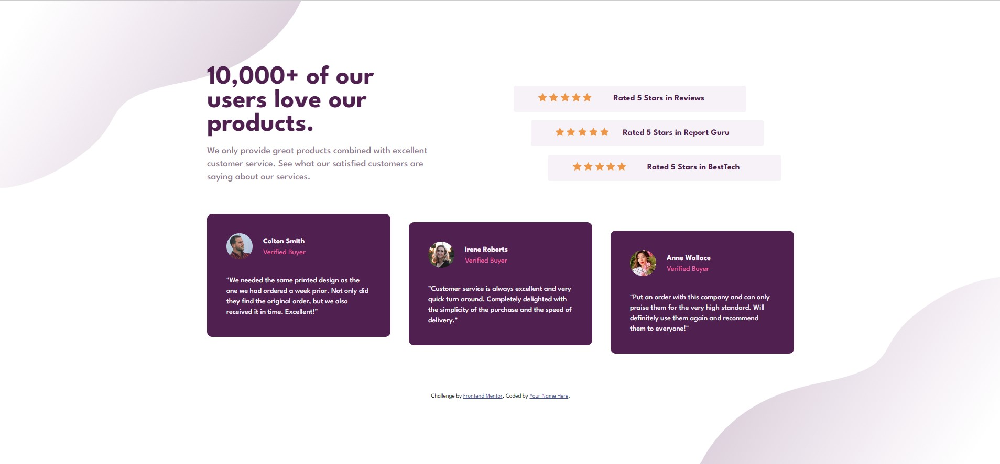

# Frontend Mentor - Social proof section solution

This is a solution to the [Social proof section challenge on Frontend Mentor](https://www.frontendmentor.io/challenges/social-proof-section-6e0qTv_bA). Frontend Mentor challenges help you improve your coding skills by building realistic projects. 

## Table of contents

- [Overview](#overview)
  - [The challenge](#the-challenge)
  - [Screenshot](#screenshot)
  - [Links](#links)
- [My process](#my-process)
  - [Built with](#built-with)
  - [What I learned](#what-i-learned)
  - [Continued development](#continued-development)
  - [Useful resources](#useful-resources)
- [Author](#author)
- [Acknowledgments](#acknowledgments)

## Overview

### The challenge

Users should be able to:

- View the optimal layout for the section depending on their device's screen size

### Screenshot

### Links

- Solution URL: [Add solution URL here](https://your-solution-url.com)
- Live Site URL: [Add live site URL here](https://your-live-site-url.com)

## My process

### Built with

- Semantic HTML5 markup
- CSS custom properties
- Flexbox
- CSS Grid
- Mobile-first workflow

### What I learned

The build process from mobile first to web at 1440px wide. In between, I added some media queries to smooth the views between the two.

I have also learned how to position elements using CSS Grid.

I've added normalize.css to try to make it look the same in all browsers.

### Continued development

Perhaps for the next time, it would be nice to use some tool that allows me to better see the CSS of the elements. Chrome's developer tools don't help that much. I think in Firefox it's a bit better.

### Useful resources

- [Normalize CSS](https://necolas.github.io/normalize.css/) - This helps normalize viewing across all browsers.
- [CodingTube Channel](https://www.youtube.com/c/CodingTube) - This is an amazing Youtube channel with hundreds of videos that explain CSS very well. Thanks, David!

## Author

- Twitter - [@migbara](https://www.twitter.com/migbara)

## Acknowledgments

Thanks to [Daniel Primo](https://twitter.com/webreactiva) for helping me find the way to continue learning web programming with his Web Reactiva podcast. And also, many thanks to [Bluuweb](https://bluuweb.github.io/) because he has inspired me and I have a great time watching his videos and live shows.
